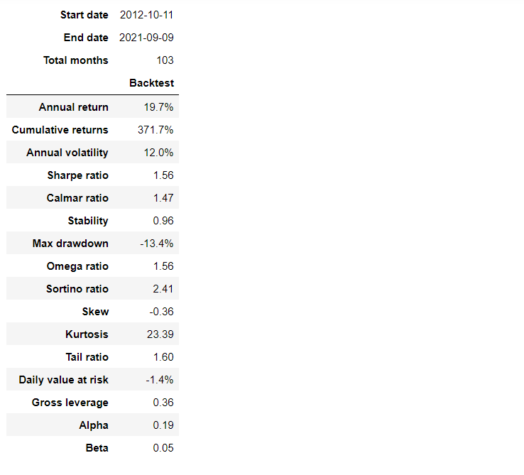
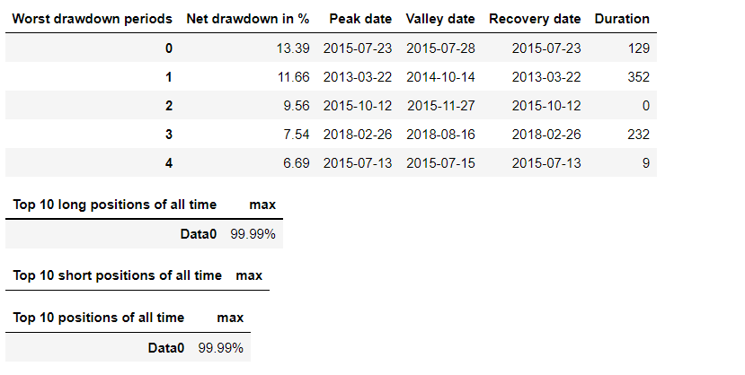
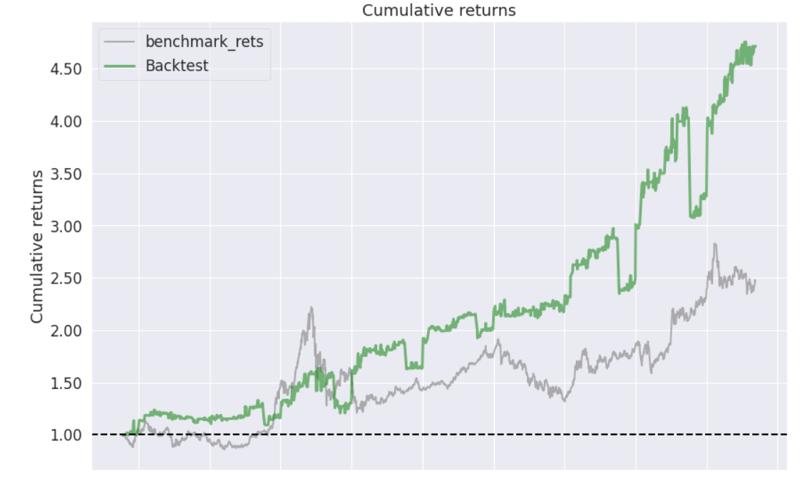
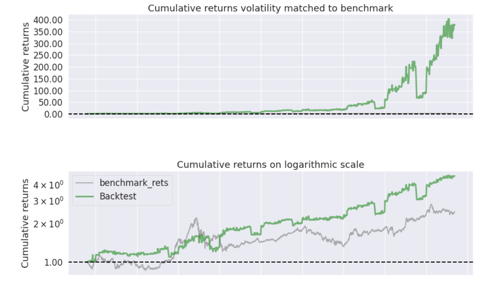
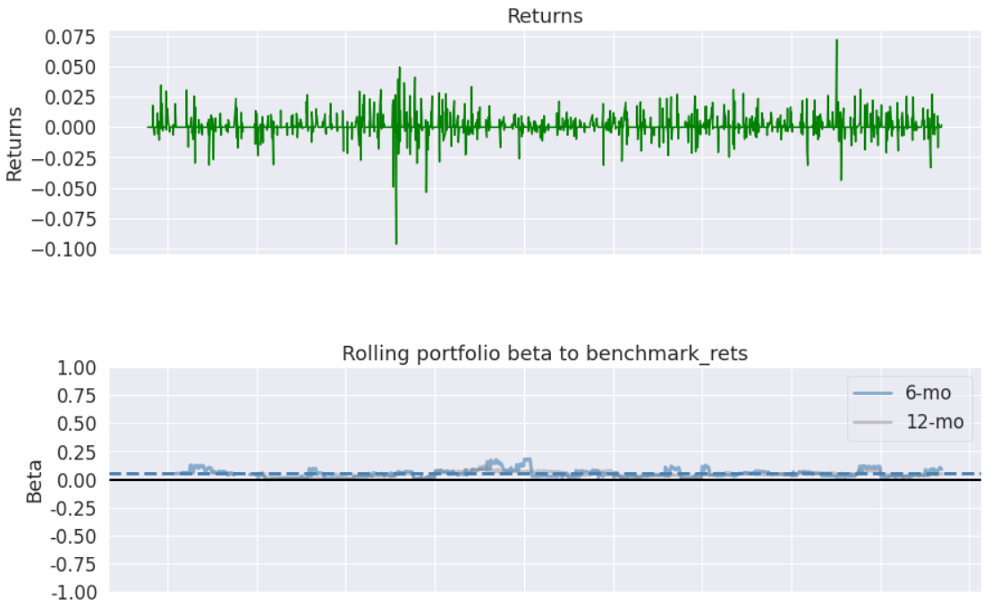
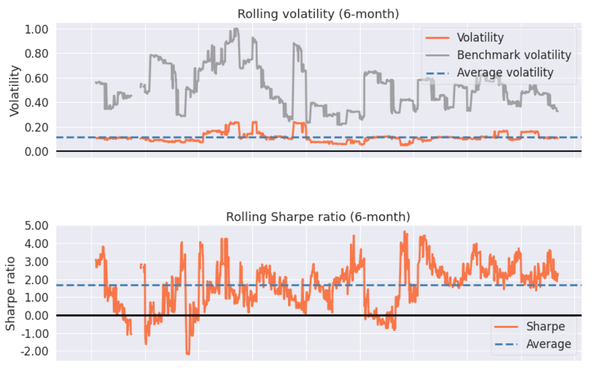
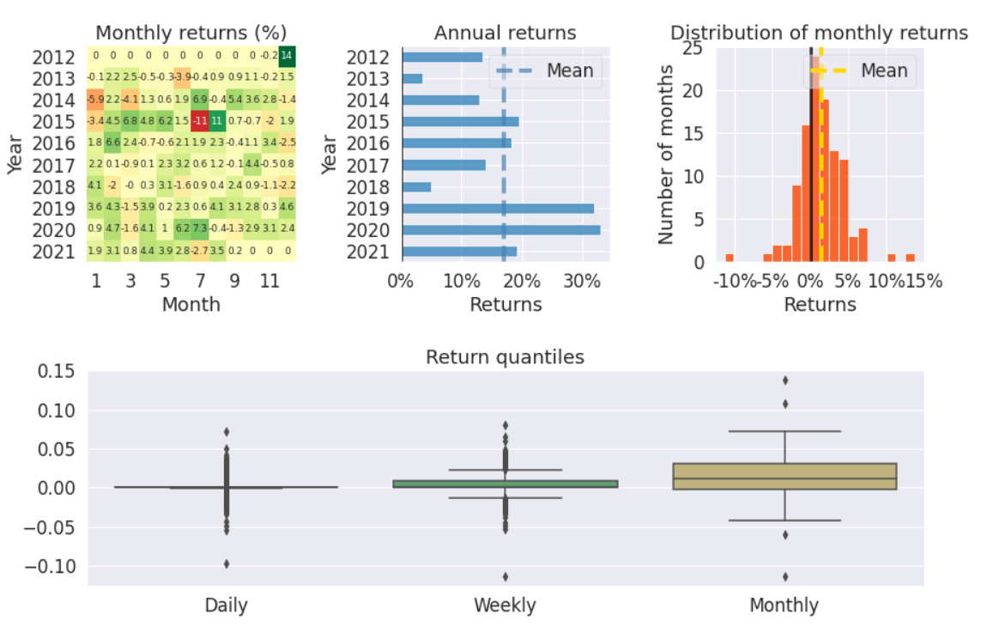
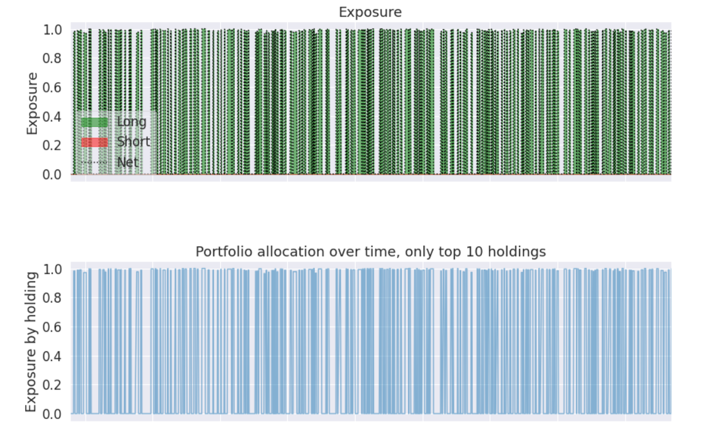
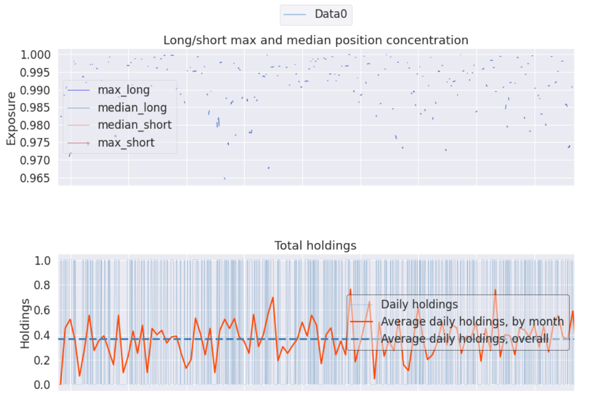
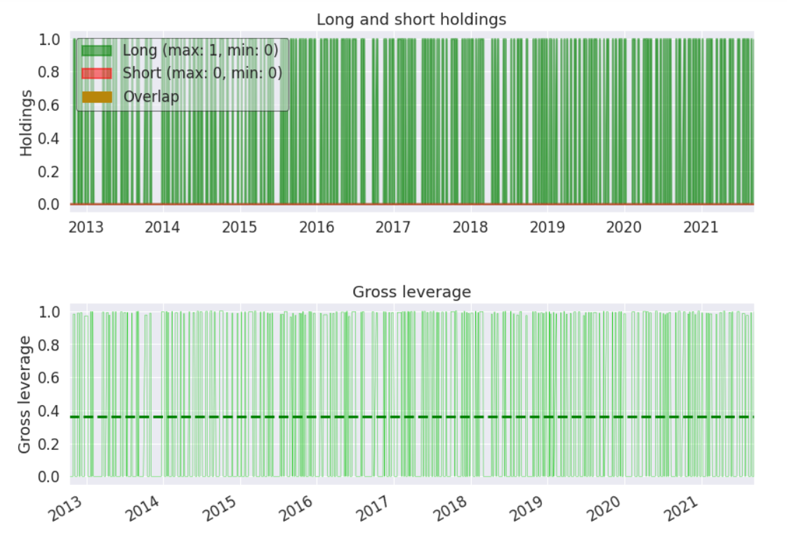

### pyfolio
<p style="text-align: center;">
    
    
    
    
</p>
#### 介绍

尝试在pyfolio的基础上，结合其他绩效分析模块的优点，
做出一个更好用的绩效分析模块，供大家使用。

主要基于python语言，使用numpy、pandas、scipy、plotly、dash、flask和
pyqt6等对原来的pyfolio进行改进优化。

#### 安装教程


安装需要进入python包的工作目录，然后git clone下载pyfolio文件

```
# 克隆项目，选择一个代码库进行克隆
git clone https://gitee.com/yunjinqi/pyfolio.git       # 国内gitee速度更快
git clone https://github.com/cloudQuant/pyfolio.git    # 国外github可能更快
# 安装依赖包
pip install -r ./pyfolio/requirements.txt
# 安装pyfolio
pip install -U ./pyfolio
# 运行测试
pytest ./pyfolio/tests/ -n 4
```

#### 使用说明

```python

import pandas as pd
import pyfolio as pf
import os
import warnings
warnings.filterwarnings("ignore")
# 加载数据
pf_path = os.path.dirname(pf.__file__)
df = pd.read_csv(pf_path+"/datas/基准收益率和日收益率序列.csv",index_col = 0)
df.index = pd.to_datetime(df.index)
positions = pd.read_csv(pf_path+"/datas/positions.csv",index_col = 0)
positions.index = pd.to_datetime(positions.index)
pf.create_full_tear_sheet(df['returns'],benchmark_rets=df['benchmark_rets'],positions= positions)

```


#### 绩效分析结果展示

##### 绩效指标分析






##### 收益相关的图







##### 持仓及杠杆相关的图






#### 一些付费文章

1. [如何使用analyzer及创建新的analyzer(4)---策略绩效评价模块pyfolio的使用](https://yunjinqi.blog.csdn.net/article/details/110842730)
2. [【答读者问37】如何使用pyfolio对比基准收益率和策略收益率？](https://yunjinqi.blog.csdn.net/article/details/122012247)
3. [使用flask给pyfolio做一个界面,可以在spyder\pycharm\vscode中呈现策略绩效分析结果(2021-10-29更新)](https://yunjinqi.blog.csdn.net/article/details/121025639)

#### 不足之处

1. 为了一些简便，这个修改版的pyfolio并没有按照正式的python包的方式进行管理，pyfolio的文件和一些git文件混杂在了一起，看起来并不美观。
2. 随着一些pyfolio的依赖模块的更新，pyfolio还可能有很多需要解决的bug，这个包目前只是万里长征的第一步。
